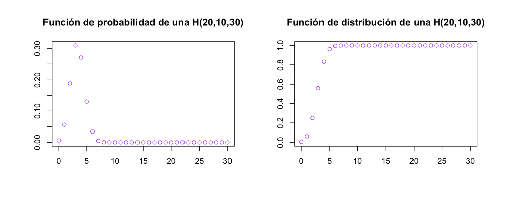

- [Estadistica Descriptiva](#estadistica-descriptiva)
  * [Muestra](#muestra)
  * [Metodos](#metodos)
    + [Cualitativos](#cualitativos)
    + [Ordinales](#ordinales)
    + [Cuantitativos](#cuantitativos)
  * [Variable Aleatoria](#variable-aleatoria)
    + [VA Discreta](#va-discreta)
    + [VA Continua](#va-continua)
  * [Frecuencia](#frecuencia)
  * [Medidas de Centralizacion](#medidas-de-centralizacion)
    + [Media](#media)
    + [Mediana](#mediana)
    + [Moda](#moda)
  * [Medidas de Dispercion](#medidas-de-dispercion)
- [Estadistica Inferencial](#estadistica-inferencial)
  * [Muestreo](#muestreo)
    + [Muestreo Aleatorio](#muestreo-aleatorio)
      - [Muestra Aleatoria con reposicion](#muestra-aleatoria-con-reposicion)
      - [Muestra Aleatoria sin reposicion](#muestra-aleatoria-sin-reposicion)
    + [Muestreo Sistematico](#muestreo-sistematico)
    + [Muestreo Estratificado](#muestreo-estratificado)
    + [Muestreo por conglomerados](#muestreo-por-conglomerados)
    + [Muestreo polietapico](#muestreo-polietapico)
  * [Estimacion Puntual](#estimacion-puntual)
    + [Media muestral](#media-muestral)
    + [Variancia y Desviacion Muestral](#variancia-y-desviacion-muestral)
- [Estadistica Multivariante](#estadistica-multivariante)
- [Probabilidad Basica](#probabilidad-basica)
- [Distribuciones Discretas](#distribuciones-discretas)
  * [Bernulli](#bernulli)
  * [Binomial](#binomial)
  * [Geometrica](#geometrica)
  * [Hipergeometrica](#hipergeometrica)

<small><i><a href='http://ecotrust-canada.github.io/markdown-toc/'>Table of contents generated with markdown-toc</a></i></small>


# Estadistica Descriptiva

## Muestra
Subconjunto de algo mas grande, de una población<br />
- Necesitamos una muestra aleatoria simple 
- La muestra tiene que ser representativa de la poblacion

## Metodos

### Cualitativos
Datos de investigacion de tipo texto, no tienen orden (sexo, pais)

### Ordinales
Son de tipo texto y tienen un orden, ejemplo: calificacion (Bueno, muy bueno, malo, muy malo, mas o menos)

### Cuantitativos
Son de tipo numerico y tienen un orden (peso, altura, edad)

## Variable Aleatoria
Lo que vamos a medir, por ejemplo, de una poblacion de personas podemos medir la altura, sexo, peso, etc..<br />
Existen 2 tipos de VA:

### VA Discreta
Que se puede contar, ejemplo: sexo, ciudad, etx..

### VA Continua
Valores reales que dificilmente sean repetidos, ejemplo: peso, altura, etc..


## Frecuencia

- **Frecuencia Absoluta:** Cantidad de veces que se repite
- **FA Acumulada:** Acumulacion de freccuencia absoluta
- **Frecuencia Relativa:** Que porcentaje del total representa
- **FR Acumulada:** Acumulo frecuencia relativa
<br />

| clase             | Frecuencia Absoluta | FA Acumulada | Frecuencia Relativa | FR Acumulada |
|-------------------|---------------------|--------------|---------------------|--------------|
| Muy Satisfactorio | 10                  | 10           | 10/25               | 10/25        |
| Satisfecho        | 7                   | 17           | 7/25                | 17/25        |
| Medio Satisfecho  | 5                   | 22           | 5/25                | 22/25        |
| Descontento       | 3                   | 25           | 3/25                | 25/25 = 1    |
|                   | Total = 25          |              | Total = 1           |              |

## Medidas de Centralizacion

### Media
Es el promedio<br />


### Mediana
Ordeno valores de menor a mayor y elijo el que esta en el medio, si hay valores pares se hace promedio de los 2 valores que quedan

### Moda
Valor que mas se repite

## Medidas de Dispercion

### Varianza

<br />
Al cuadrado para que la suma no de numeros negativos

### Desviacion tipica

<br />
El valor real de la dispersion

## Medidas de Posicion

### Cuantiles

- Cuartiles (25%, 50%, 75%)
- Quintiles (20%,40%,60%,80%)
- Deciles (10%,20%,30%,...,90%)
- Perciles (1%,2%,3%,4%,5%,...,99%)

### Cuartiles
Se especifica con la Q<br />

- Q1 debajo del 25%
- Q2 debajo del 50%
- Q3 debajo del 75%

#### Ejemplo:
Datos: 2;3;5;6;7;9;10;11;13<br />
Q3 = 3(9/4) = 6.75<br /><br />
el valor es 7, siempre va por el decimal de arriba, por mas que de 6.25<br />
Seria el 7mo valor (10) <br />

2;3;5;6;7;9;**10**;11;13<br />


# Estadistica Inferencial 
Mediante una muestra quiero poder llegar a describir lo mas certeramente posible la poblacion total.<br /><br />
Pasos para un estudio Inferencial:
- Establecer la caracteristica que se desea estimar o la hipotesis que se desea constatar
- Determinar que informacion nos hace falta para hacerlo
- Se diseña un experimento que permita recoger estos datos, este paso incluye
  * Decidir que tipo de muestra se va a tomar y su tamaño
  * Elegir las tecnicas adecuadas para realizar las inferencias deseadas a partir de la muestra que se tomara
- Tomamos esa muestra y medimos los datos deseados sobre los individuos que la forman
- Aplicar las tecnicas de inferencia elegidascon el software adecuado (Python o R)
- Obtener conclusiones
- Si las conclusiones son fiables y suficientes, redactar un informe; en caso contrario, volver a empezar.
<br />


## Muestreo
Tendremos que distinguir entre **Poblacion** y **muestra** (subconjunto de la poblacion)<br />
Dos tipos de analisis estadisticos:
- **Exploratorio** o **Descriptivo**: **Estadistica Descriptiva**
  * desribimos lo que viene de la muestra
- **Inferencial** o **confirmatorio**: **Estadistica Inferencial**
  * mediante una muestra quiero poder llegar a describir la poblacion
<br /><br />

### Muestreo Aleatorio
Consiste en seleccionar una muestra de la poblacion de manera que todas las muestras del mismo tamaño sean equiprobables (El tipico caso de las bolas)<br />

#### Muestra Aleatoria con reposicion
<br />
Las bolas pueden salir mas de una vez

```r
sample(1:100, 15, replace=TRUE) # Elegimos 15 al azar
```

```r
head(iris)

set.seed(4) # seteamos una semilla para que los valores aleatorios sean siempre iguales

flores.elegidas = sample(1:150,10, replace= TRUE) #Elegimos 10
muestra.iris = iris[flores.elegidas,]
```

#### Muestra Aleatoria sin reposicion
<br />
No puede salir una bola 2 veces

```r
sample(1:100, 15, replace=FALSE) # Elegimos 15 al azar sin repetir
```
Se puede considerar que con reposicion y sin reposicion son equivalentes si el tamaño de la poblacion es muy grande en relacion a la muestra (al menos una 1000 veces mayor)

### Muestreo Sistematico
Suponiendo que los individuos de una poblacion vienen de una lista ordenada, se toman en intervalos constantes escogiendo al azar el primer individuo<br />
En este caso elegimos uno al azar (el 92) y vamos contando de intervalos (en este caso 7)<br />
<br />

```r
primer.valor = sample(1:150,1) # Elegir el primer valor
incremento = floor(150/10) # de las 150 quiero elegir 10

# long total de 10 elementos
# pero de esta manera puede pasa los 150
# si eligo como primera 130 van: 130, 140, 150, 160, 170,...
elegidas = seq(from=primer.valor, by=incremento, length.out=10) 

# para esto lo que hacemos es aplicar el modulo que me devuelve el resto
# si es 160 me daria 10
elegidas = elegidas%%150

muestra = iris[elegidas,]

```

### Muestreo Estratificado
Selecciono entre estratos, por ejemplo entre hombres y mujeres<br />
<br />
La idea seria tomar una muestra aleatoria proporcional a cada una, en este ejemplo tomariamos 6 del primer color y 9 del segundo, siendo un total de 15


### Muestreo por conglomerados
Cuando el proceso de obtener y estudiar una muestra aleatoria es dificil<br />
En este caso en lugar de extraer muestras aleatorias, escogemos primero un subconjunto al azar. Esto lo llamamos por **cluster**<br />
Ej: en lugar de ir a diferentes personas podriamos ir a un edificio y encuestarlos ahi, seria menos costoso<br />
<br />
En este ejemplo supongamos que son 20 edificios con 5 personas cada uno y elegimos 3 conglomerados<br />

```r
#Suponiendo que quiero medir jugadores de un mundial, y en este caso eligo 4 paises

numero.paises.elegidos = sample(1:32,4,replace=FALSE) # De 32 paises elijo 4
paises.elegidos = unique(wolrdcup$Team)[numero.paises.elegidos] # me traigo los paises

# me traigo los jugadores de esos 4 paises
muestra.worldcup = worldcup[wolrdcup$Team%in%paises.elegidos]
```

### Muestreo polietapico
Igual que por conglomerado pero selecciono aleatoriamente dentro de cada grupo<br />
<br />

```r
#Suponiendo que quiero medir jugadores de un mundial, y en este caso eligo 4 paises

numero.paises.elegidos = sample(1:32,4,replace=FALSE) # De 32 paises elijo 4
paises.elegidos = unique(wolrdcup$Team)[numero.paises.elegidos] # me traigo los paises

# Me traigo los jugadores de cada pais (de los 4)
worldcup.pais1 = worldcup[wolrdcup$Team == paises.elegidos[1],]
worldcup.pais2 = worldcup[wolrdcup$Team == paises.elegidos[2],]
worldcup.pais3 = worldcup[wolrdcup$Team == paises.elegidos[3],]
worldcup.pais4 = worldcup[wolrdcup$Team == paises.elegidos[4],]

# Elijo 5 jugadores de cada pais
jugadores.pais1 = sample(1:dim(worldcup.pais1)[1],5,replace=FALSE)
jugadores.pais2 = sample(1:dim(worldcup.pais2)[1],5,replace=FALSE)
jugadores.pais3 = sample(1:dim(worldcup.pais3)[1],5,replace=FALSE)
jugadores.pais4 = sample(1:dim(worldcup.pais4)[1],5,replace=FALSE)

# Juntamos la muestra
muestra.worldcup = rbind(
  worldcup.pais1[jugadores.pais1,],
  worldcup.pais2[jugadores.pais2,],
  worldcup.pais3[jugadores.pais3,],
  worldcup.pais4[jugadores.pais4,]
  )
```

## Estimacion Puntual
Un **Estimador Puntual** es una funcion que aplicada a una muestra nos permite estimar un valor que queramos conocer sobre toda la poblacion<br />
<br />

### Media muestral
<br />
Si vamos tomando mas valores en la muestra el error seria menor, lo cual tiene sentido porque se iria acercando mas a la poblacion<br />
<br />
Para este ejemplo:
- generaremos 10000 muestras de tamaño 40
- hallaremos los valores medios de cada muestra
- veremos la media y desviacion tipica de dichos valores y los comprararemos con la media poblacional

```r
# replicate(n, expresion)
#    n -> veces que queres ejecutar la expresion
#    expresion -> lo que vamos a ejecutar

valores.medios = replicate(10000, mean(
                                sample(iris$Petal.Length, 40, replace = FALSE)
                              ))

# calcuamos el valor medio de los valores medios
mean(valores.medios)

# deberia acercarse a la esperanza o el valor medio de toda la poblacion
mean(iris$Petal.Length)


sd(valores.medios) # Desviacion tipica de la muestra
sd(iris$Petal.Length/sqrt(40)) # Esos valores tienen que estar cerca de la poblacion
```
Nosotros vamos a querer estudiar muestras y muchas veces vamos a tener que estandarizar los valores para que sean normales<br />


### Variancia y Desviacion Muestral
<br />

La tilde arriba de la **S** indica que es de la muestra<br />
En la variancia, cuando se trata de **muestra** hay que dividir por **n - 1**<br />
La poblacional seria:<br />
<br />

**Propiedades:**<br />
Para un ordenador es menos pesado hacerlo de esta otra forma, lo que esta entre parentesis<br />
<br />

# Estadistica Multivariante

# Probabilidad Basica

# Distribuciones Discretas 

## Bernulli
X como VA que mide el numero de exitos

```
X~Be(p)

1 exito
0 fracaso
```
Tirar una moneda al aire y el exito seria cara, cruz fracaso<br />
Muy pobre, solo puede tomar 1 valores: exito o fracaso<br />

```r
# P de sacar 1 es 0,7
dbern(1, 0.7)
```

## Binomial 
No solo exitos y fracasos, sino el numero de exitos

```
X~B(n,p)

n -> numero de veces
p -> prob de exito
q -> prob de fracaso

q = 1 - p
```

Con tomar n = 1 seria igual que **Bernulli**

```r
n = 30 # tomo 30 valores
p = 0.6 
N = 100000 # Poblacion total
rbinom(N, n, p)

# Cuantos de los 30 fueron exitosos
```
<br />

- En R tenemos las funciones del paquete Rlab: dbinom(x, size, prob), pbinom(q,size, prob), qbinom(p, size, prob), rbinom(n, size, prob) donde prob es la probabilidad de éxito y size el número de ensayos del experimento.

- En Python tenemos las funciones del paquete scipy.stats.binom: pmf(k,n,p), cdf(k,n,p), ppf(q,n,p), rvs(n, p, size) donde p es la probabilidad de éxito y n el número de ensayos del experimento

## Geometrica
X mide numero de repeticiones hasta haber conseguido el exito
```
X~Ge(p)

p -> probabilidad de exito
```
Un ejemplo seria el borracho, que intenta abrir la puerta con muchas llaves hasta que lo consigue<br />

<br />

- En R tenemos las funciones del paquete Rlab: dgeom(x, prob), pgeom(q, prob), qgeom(p, prob), rgeom(n, prob) donde prob es la probabilidad de éxito del experimento.

- En Python tenemos las funciones del paquete scipy.stats.geom: pmf(k,p), cdf(k,p), ppf(q,p), rvs(p, size) donde p es la probabilidad de éxito del experimento

## Hipergeometrica
Se extrae a la vez **n** objetos de una caja, los sacamos y no los devolvemos, donde hay **N** de tipo **A** y **M** de tipo **B**
```
X~H(N,M,n)
```
Si tenemos 20 animales, entre ellos perros y gatos, haciendo una extraccion, cual es la probabilidad de sacar una cantidad de gatos y perros

```r
dhyper(x,m,n,k)
```
```
m -> n obj primer tipo
n -> n obj segundo tipo
k -> n extracciones
```
Tenemos 20 animales, 7 perros y 13 gatos. Queremos medil la probabilidad si elegimos 12 animales al azar
```
dhyper(x=0:12, m=7, n=13, k=12)

encontrar:

0 perros - 0.00010
1 perros - 0.004
2 perros - 0.04
3 perros - 0.19
```

<br />

- En R tenemos las funciones del paquete Rlab: dhyper(x, m, n, k), phyper(q, m, n, k), qhyper(p, m, n, k), rhyper(nn, m, n, k) donde m es el número de objetos del primer tipo, n el número de objetos del segundo tipo y k el número de extracciones realizadas.

- En Python tenemos las funciones del paquete scipy.stats.hypergeom: pmf(k,M, n, N), cdf(k,M, n, N), ppf(q,M, n, N), rvs(M, n, N, size) donde M es el número de objetos del primer tipo, N el número de objetos del segundo tipo y n el número de extracciones realizadas.